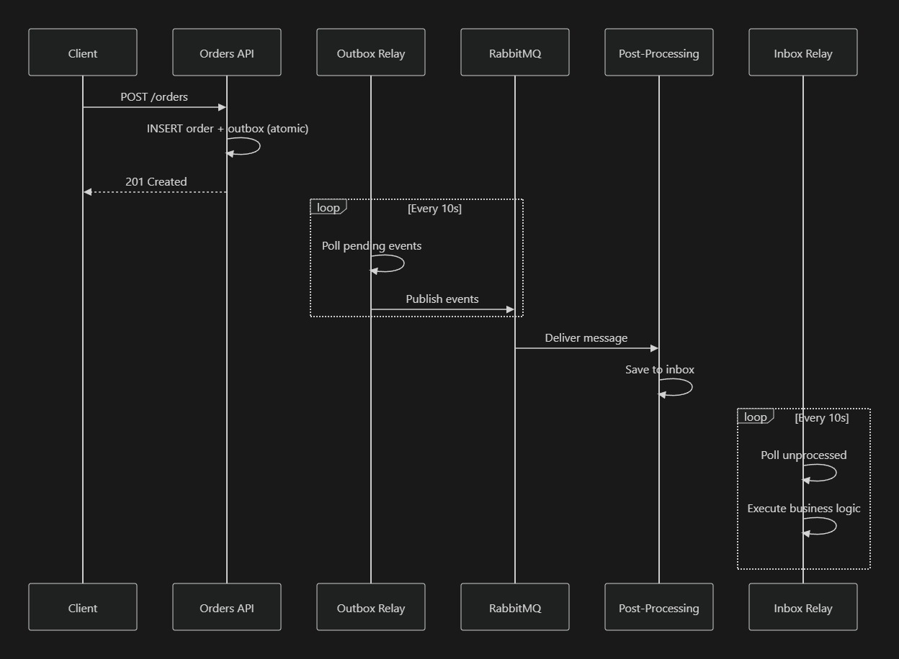

## Transactional Outbox Pattern

Implementation of the **Transactional Outbox Pattern** with PHP, PostgreSQL, and RabbitMQ to ensure eventual consistency in distributed architectures.

This pattern solves the **dual-write** problem: it ensures events are published reliably even when failures occur, by using an outbox table as a transactional log.

### Architecture



### Services

- **Orders Service**: REST API to create orders (Slim 4)
- **Outbox Relay**: Publishes pending events to RabbitMQ
- **Post-Processing**: Consumes RabbitMQ and persists events to the inbox
- **Inbox Relay**: Executes business logic (emails, integrations)

### RabbitMQ: exchange and queue

**Exchange (`orders_exchange`)**:
- Entry point for messages in RabbitMQ
- `topic` type: routes messages based on routing keys
- Receives events from the Outbox Relay

**Queue (`inbox_queue`)**:
- Queue that stores messages for consumption
- Bound to the exchange with the pattern `order.*`
- Consumed by the Post-Processing Service

**Flow:**
```
Outbox Relay → [Exchange: orders_exchange] 
                    ↓ (routing: order.*)
               [Queue: inbox_queue] → Post-Processing
```

### Quick Start

```bash
# Install dependencies
make setup

# Start all services
make up

# Create a test order
make test-order

# View logs
make logs
```

**Available endpoints:**
- API: http://localhost:8080
- RabbitMQ Management: http://localhost:15672 (guest/guest)
- Jaeger UI: http://localhost:16686

## Structure

```
outbox/
├── orders-service/      # REST API
├── relay-service/       # Publishes to RabbitMQ
└── docker-compose.yml

inbox/
├── post-processing-service/  # Consumes RabbitMQ
├── relay-service/            # Executes business logic
└── docker-compose.yml
```

### Useful commands

```bash
make help              # List all commands
make up-outbox         # Outbox only
make up-inbox          # Inbox only
make logs-outbox-relay # Outbox relay logs
make logs-inbox-relay  # Inbox relay logs
make rebuild           # Rebuild containers
make clean             # Remove everything
```

### Testing
Use the `requests.http` file in VS Code (REST Client extension) or:

```bash
curl -X POST http://localhost:8080/orders \
  -H "Content-Type: application/json" \
  -d '{"customer_name":"John Doe","customer_email":"john@example.com","total_amount":99.99}'
```